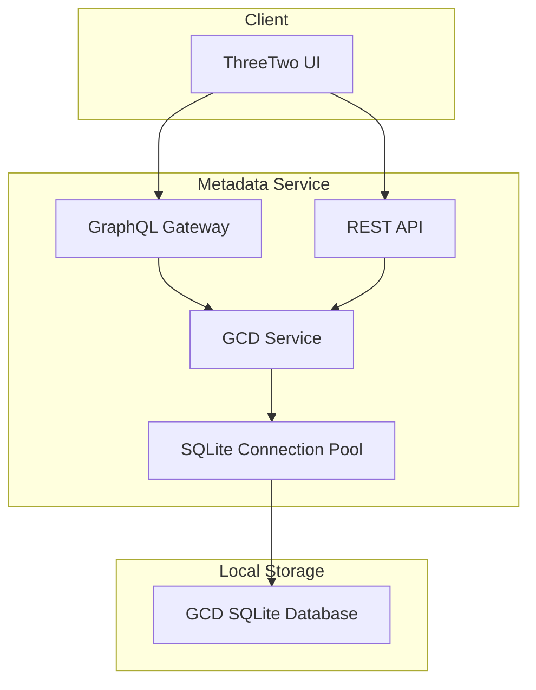

# Grand Comics Database (GCD) Integration Plan

## Overview

This document outlines the architecture and implementation plan for integrating the Grand Comics Database (GCD) into the ThreeTwo metadata service. Unlike ComicVine and Metron which use external APIs, GCD integration will query a local SQLite database dump.

## Key Characteristics

| Aspect | GCD Approach |
|--------|--------------|
| Data Source | Local SQLite database file |
| Authentication | None (local file access) |
| Rate Limiting | N/A (local queries) |
| Data Updates | Manual database file replacement |
| Performance | Fast (local queries, can be indexed) |

## Architecture Diagram



## GCD Database Schema (Core Tables)

Based on the public GCD documentation, the key tables are:

### gcd_publisher
```sql
- id: INTEGER PRIMARY KEY
- name: VARCHAR(255)
- country_id: INTEGER (FK)
- year_began: INTEGER
- year_ended: INTEGER
- url: VARCHAR(255)
- notes: TEXT
```

### gcd_series
```sql
- id: INTEGER PRIMARY KEY
- name: VARCHAR(255)
- sort_name: VARCHAR(255)
- year_began: INTEGER
- year_ended: INTEGER
- publication_dates: VARCHAR(255)
- issue_count: INTEGER
- publisher_id: INTEGER (FK to gcd_publisher)
- country_id: INTEGER (FK)
- language_id: INTEGER (FK)
- notes: TEXT
- color: VARCHAR(255)
- dimensions: VARCHAR(255)
- paper_stock: VARCHAR(255)
- binding: VARCHAR(255)
- publishing_format: VARCHAR(255)
```

### gcd_issue
```sql
- id: INTEGER PRIMARY KEY
- number: VARCHAR(50)
- series_id: INTEGER (FK to gcd_series)
- publication_date: VARCHAR(255)
- key_date: VARCHAR(10)  -- YYYY-MM-DD format
- price: VARCHAR(255)
- page_count: DECIMAL
- indicia_publisher_id: INTEGER
- brand_id: INTEGER
- editing: TEXT
- notes: TEXT
- barcode: VARCHAR(50)
- isbn: VARCHAR(50)
- variant_of_id: INTEGER (FK to gcd_issue)
- variant_name: VARCHAR(255)
```

### gcd_story
```sql
- id: INTEGER PRIMARY KEY
- title: VARCHAR(255)
- type_id: INTEGER (FK to gcd_story_type)
- sequence_number: INTEGER
- issue_id: INTEGER (FK to gcd_issue)
- page_count: DECIMAL
- script: TEXT
- pencils: TEXT
- inks: TEXT
- colors: TEXT
- letters: TEXT
- editing: TEXT
- synopsis: TEXT
- characters: TEXT
- notes: TEXT
```

### gcd_story_credit
```sql
- id: INTEGER PRIMARY KEY
- story_id: INTEGER (FK to gcd_story)
- creator_id: INTEGER (FK to gcd_creator)
- credit_type_id: INTEGER (FK to gcd_credit_type)
- is_credited: BOOLEAN
- credited_as: VARCHAR(255)
```

### gcd_creator
```sql
- id: INTEGER PRIMARY KEY
- name: VARCHAR(255)
- sort_name: VARCHAR(255)
- birth_date: VARCHAR(10)
- death_date: VARCHAR(10)
- bio: TEXT
```

## Implementation Plan

### Phase 1: Foundation

#### 1.1 TypeScript Types (`types/gcd.types.ts`)

```typescript
// Core entity types
export interface GCDPublisher {
  id: number;
  name: string;
  country_id: number | null;
  year_began: number | null;
  year_ended: number | null;
  url: string | null;
}

export interface GCDSeries {
  id: number;
  name: string;
  sort_name: string | null;
  year_began: number | null;
  year_ended: number | null;
  issue_count: number;
  publisher_id: number;
  publisher?: GCDPublisher;
  notes: string | null;
  publishing_format: string | null;
}

export interface GCDIssue {
  id: number;
  number: string;
  series_id: number;
  series?: GCDSeries;
  publication_date: string | null;
  key_date: string | null;  // YYYY-MM-DD
  price: string | null;
  page_count: number | null;
  barcode: string | null;
  isbn: string | null;
  variant_of_id: number | null;
  variant_name: string | null;
  notes: string | null;
}

export interface GCDStory {
  id: number;
  title: string | null;
  type_id: number;
  sequence_number: number;
  issue_id: number;
  page_count: number | null;
  synopsis: string | null;
  characters: string | null;
}

export interface GCDCredit {
  id: number;
  story_id: number;
  creator_id: number;
  credit_type_id: number;
  creator_name: string;
  role: string;
}

// Search result types
export interface GCDSeriesSearchResult {
  count: number;
  results: GCDSeries[];
}

export interface GCDIssueSearchResult {
  count: number;
  results: GCDIssue[];
}

// Scorer types (matching Metron pattern)
export interface GCDScorerConfig {
  searchParams: {
    name: string;
    issueNumber?: string;
    year?: string;
    publisher?: string;
  };
}

export interface ScoredGCDMatch {
  issue: GCDIssue;
  series: GCDSeries;
  score: number;
  nameMatchScore?: number;
  issueNumberScore?: number;
  yearScore?: number;
}

export interface GCDVolumeSearchResult {
  finalMatches: ScoredGCDMatch[];
  rawFileDetails?: Record<string, unknown>;
  scorerConfiguration: GCDScorerConfig;
}

// Error codes
export const GCD_ERROR_CODES = {
  DATABASE_NOT_FOUND: 'GCD_DATABASE_NOT_FOUND',
  DATABASE_ERROR: 'GCD_DATABASE_ERROR',
  NOT_FOUND: 'GCD_NOT_FOUND',
  INVALID_QUERY: 'GCD_INVALID_QUERY',
} as const;

// Status types for Socket.IO events
export type GCDScrapingStage = 
  | 'searching_series'
  | 'ranking_series'
  | 'searching_issues'
  | 'fetching_details'
  | 'scoring_matches'
  | 'complete'
  | 'error';

export interface GCDScrapingStatus {
  stage: GCDScrapingStage;
  message: string;
  error?: {
    code: string;
    context: string;
  };
}
```

#### 1.2 SQLite Database Service (`services/gcd.service.ts`)

```typescript
// Service structure outline
export default class GCDService extends Service {
  private db: Database | null = null;
  
  // Lifecycle
  created(): void;     // Log config status
  started(): Promise<void>;  // Open database connection
  stopped(): Promise<void>;  // Close database connection
  
  // Actions
  actions: {
    health: { ... },           // Check database status
    searchSeries: { ... },     // Search series by name
    getSeriesById: { ... },    // Get series details
    searchIssues: { ... },     // Search issues with filters
    getIssueById: { ... },     // Get issue details
    volumeBasedSearch: { ... }, // Main search with scoring
  }
  
  // Private methods
  private isConfigured(): boolean;
  private validateConfiguration(): void;
  private openDatabase(): Promise<void>;
  private closeDatabase(): Promise<void>;
  private broadcastStatus(...): Promise<void>;
}
```

### Phase 2: Service Implementation

#### 2.1 Environment Configuration

```bash
# Required
GCD_DATABASE_PATH=/path/to/gcd.sqlite

# Optional
GCD_ENABLE_WAL=true          # Enable WAL mode for better read performance
GCD_CACHE_SIZE=10000         # SQLite cache size in pages
```

#### 2.2 Database Connection Management

```typescript
import Database from 'better-sqlite3';

// Connection with optimizations for read-heavy workload
private async openDatabase(): Promise<void> {
  const dbPath = process.env.GCD_DATABASE_PATH;
  
  this.db = new Database(dbPath, { 
    readonly: true,           // Read-only since we don't modify GCD data
    fileMustExist: true,      // Fail if database doesn't exist
  });
  
  // Performance optimizations
  if (process.env.GCD_ENABLE_WAL === 'true') {
    this.db.pragma('journal_mode = WAL');
  }
  this.db.pragma(`cache_size = ${process.env.GCD_CACHE_SIZE || 10000}`);
  this.db.pragma('temp_store = memory');
}
```

#### 2.3 Core Actions

**searchSeries:**
```typescript
searchSeries: {
  rest: 'GET /series/search',
  params: {
    name: { type: 'string' },
    page: { type: 'number', optional: true, default: 1 },
    limit: { type: 'number', optional: true, default: 20 },
  },
  handler: async (ctx: Context<SearchSeriesParams>): Promise<GCDSeriesSearchResult> => {
    const { name, page, limit } = ctx.params;
    const offset = (page - 1) * limit;
    
    // Use FTS5 if available, otherwise LIKE
    const stmt = this.db.prepare(`
      SELECT s.*, p.name as publisher_name
      FROM gcd_series s
      LEFT JOIN gcd_publisher p ON s.publisher_id = p.id
      WHERE s.name LIKE ?
      ORDER BY s.year_began DESC, s.name
      LIMIT ? OFFSET ?
    `);
    
    const countStmt = this.db.prepare(`
      SELECT COUNT(*) as count FROM gcd_series WHERE name LIKE ?
    `);
    
    const results = stmt.all(`%${name}%`, limit, offset);
    const { count } = countStmt.get(`%${name}%`);
    
    return { count, results };
  }
}
```

**getSeriesById:**
```typescript
getSeriesById: {
  rest: 'GET /series/:id',
  params: {
    id: { type: 'number', convert: true },
  },
  handler: async (ctx: Context<{ id: number }>): Promise<GCDSeries> => {
    const stmt = this.db.prepare(`
      SELECT s.*, p.name as publisher_name, p.id as publisher_id
      FROM gcd_series s
      LEFT JOIN gcd_publisher p ON s.publisher_id = p.id
      WHERE s.id = ?
    `);
    
    const result = stmt.get(ctx.params.id);
    if (!result) {
      throw new MoleculerError('Series not found', 404, GCD_ERROR_CODES.NOT_FOUND);
    }
    return result;
  }
}
```

**searchIssues:**
```typescript
searchIssues: {
  rest: 'GET /issue/search',
  params: {
    series_id: { type: 'number', optional: true, convert: true },
    series_name: { type: 'string', optional: true },
    number: { type: 'string', optional: true },
    year: { type: 'number', optional: true, convert: true },
    page: { type: 'number', optional: true, default: 1 },
    limit: { type: 'number', optional: true, default: 20 },
  },
  handler: async (ctx: Context<SearchIssuesParams>): Promise<GCDIssueSearchResult> => {
    // Build dynamic WHERE clause based on provided params
    const conditions: string[] = [];
    const params: any[] = [];
    
    if (ctx.params.series_id) {
      conditions.push('i.series_id = ?');
      params.push(ctx.params.series_id);
    }
    if (ctx.params.series_name) {
      conditions.push('s.name LIKE ?');
      params.push(`%${ctx.params.series_name}%`);
    }
    if (ctx.params.number) {
      conditions.push('i.number = ?');
      params.push(ctx.params.number);
    }
    if (ctx.params.year) {
      conditions.push('SUBSTR(i.key_date, 1, 4) = ?');
      params.push(ctx.params.year.toString());
    }
    
    const whereClause = conditions.length > 0 
      ? 'WHERE ' + conditions.join(' AND ')
      : '';
    
    const stmt = this.db.prepare(`
      SELECT i.*, s.name as series_name, s.year_began, s.publisher_id
      FROM gcd_issue i
      JOIN gcd_series s ON i.series_id = s.id
      ${whereClause}
      ORDER BY i.key_date DESC
      LIMIT ? OFFSET ?
    `);
    
    // ... execute and return
  }
}
```

**volumeBasedSearch:**
```typescript
volumeBasedSearch: {
  rest: 'POST /volumeBasedSearch',
  params: {
    scorerConfiguration: { type: 'object' },
    rawFileDetails: { type: 'object', optional: true },
  },
  handler: async (ctx: Context<GCDVolumeSearchParams>): Promise<GCDVolumeSearchResult> => {
    // Stage 1: Search series
    await this.broadcastStatus(ctx, 'searching_series', `Searching for: ${searchParams.name}`);
    const seriesResults = await this.searchSeriesInternal(searchParams.name);
    
    // Stage 2: Rank series
    await this.broadcastStatus(ctx, 'ranking_series', `Ranking ${seriesResults.length} series`);
    const rankedSeries = rankGCDSeries(seriesResults, scorerConfiguration);
    
    // Stage 3: Search issues in top series
    await this.broadcastStatus(ctx, 'searching_issues', 'Searching issues...');
    const candidates = await this.searchIssuesForSeries(rankedSeries, searchParams);
    
    // Stage 4: Score matches
    await this.broadcastStatus(ctx, 'scoring_matches', `Scoring ${candidates.length} matches`);
    const scoredMatches = scoreGCDMatches(candidates, scorerConfiguration);
    
    // Stage 5: Complete
    await this.broadcastStatus(ctx, 'complete', `Found ${scoredMatches.length} matches`);
    
    return { finalMatches: scoredMatches, rawFileDetails, scorerConfiguration };
  }
}
```

### Phase 3: Scorer Utility

#### 3.1 GCD Scorer (`utils/gcd-scorer.utils.ts`)

```typescript
export function rankGCDSeries(
  series: GCDSeries[],
  config: GCDScorerConfig
): GCDSeries[] {
  const searchName = config.searchParams.name.toLowerCase();
  const searchYear = config.searchParams.year ? parseInt(config.searchParams.year, 10) : null;
  
  return series
    .map(s => ({
      ...s,
      _score: calculateSeriesScore(s, searchName, searchYear),
    }))
    .sort((a, b) => b._score - a._score);
}

function calculateSeriesScore(
  series: GCDSeries, 
  searchName: string, 
  searchYear: number | null
): number {
  let score = 0;
  
  // Name matching (0-50 points)
  const seriesName = series.name.toLowerCase();
  if (seriesName === searchName) {
    score += 50;  // Exact match
  } else if (seriesName.startsWith(searchName)) {
    score += 40;  // Starts with
  } else if (seriesName.includes(searchName)) {
    score += 25;  // Contains
  }
  
  // Year matching (0-30 points)
  if (searchYear && series.year_began) {
    const yearDiff = Math.abs(series.year_began - searchYear);
    if (yearDiff === 0) score += 30;
    else if (yearDiff <= 1) score += 20;
    else if (yearDiff <= 3) score += 10;
  }
  
  // Prefer series with more issues (0-10 points)
  score += Math.min(10, series.issue_count / 10);
  
  // Prefer series with publisher info (0-10 points)
  if (series.publisher_id) score += 10;
  
  return score;
}

export function scoreGCDMatches(
  candidates: IssueCandidate[],
  config: GCDScorerConfig
): ScoredGCDMatch[] {
  return candidates
    .map(c => ({
      issue: c.issue,
      series: c.series,
      score: calculateMatchScore(c, config),
      nameMatchScore: calculateNameScore(c.series.name, config.searchParams.name),
      issueNumberScore: calculateIssueNumberScore(c.issue.number, config.searchParams.issueNumber),
      yearScore: calculateYearScore(c.issue.key_date, config.searchParams.year),
    }))
    .sort((a, b) => b.score - a.score);
}
```

### Phase 4: GraphQL Integration

#### 4.1 GraphQL Types (additions to `typedef.ts`)

```graphql
# ============================================
# GCD Types
# ============================================

# GCD Publisher
type GCDPublisher {
  id: Int!
  name: String!
  year_began: Int
  year_ended: Int
  url: String
}

# GCD Series
type GCDSeries {
  id: Int!
  name: String!
  sort_name: String
  year_began: Int
  year_ended: Int
  issue_count: Int!
  publisher: GCDPublisher
  publishing_format: String
}

# GCD Issue
type GCDIssue {
  id: Int!
  number: String!
  series_id: Int!
  series: GCDSeries
  publication_date: String
  key_date: String
  price: String
  page_count: Float
  barcode: String
  isbn: String
  variant_name: String
}

# GCD Story (for detailed issue info)
type GCDStory {
  id: Int!
  title: String
  sequence_number: Int!
  page_count: Float
  synopsis: String
  characters: String
  credits: [GCDCredit!]
}

# GCD Credit
type GCDCredit {
  id: Int!
  creator_name: String!
  role: String!
}

# GCD Series Search Result
type GCDSeriesSearchResult {
  count: Int!
  results: [GCDSeries!]!
}

# GCD Issue Search Result
type GCDIssueSearchResult {
  count: Int!
  results: [GCDIssue!]!
}

# Scored GCD Match
type ScoredGCDMatch {
  issue: GCDIssue!
  series: GCDSeries!
  score: Float!
  nameMatchScore: Float
  issueNumberScore: Float
  yearScore: Float
}

# GCD Volume Search Result
type GCDVolumeSearchResult {
  finalMatches: [ScoredGCDMatch!]!
  rawFileDetails: JSON
  scorerConfiguration: JSON
}

# GCD Health Response
type GCDHealthResponse {
  status: String!
  configured: Boolean!
  databasePath: String
  databaseSize: String
  lastModified: String
}

# ============================================
# GCD Input Types
# ============================================

input GCDSeriesSearchInput {
  name: String!
  page: Int
  limit: Int
}

input GCDIssueSearchInput {
  series_id: Int
  series_name: String
  number: String
  year: Int
  page: Int
  limit: Int
}

input GCDScorerConfigInput {
  searchParams: GCDSearchParamsInput!
}

input GCDSearchParamsInput {
  name: String!
  issueNumber: String
  year: String
  publisher: String
}

input GCDVolumeSearchInput {
  scorerConfiguration: GCDScorerConfigInput!
  rawFileDetails: JSON
}

# ============================================
# GCD Queries (add to Query type)
# ============================================

extend type Query {
  # Check GCD service health and database status
  gcdHealth: GCDHealthResponse!
  
  # Search GCD for series by name
  searchGCDSeries(input: GCDSeriesSearchInput!): GCDSeriesSearchResult!
  
  # Get GCD series details by ID
  getGCDSeriesById(id: Int!): GCDSeries!
  
  # Search GCD for issues with filters
  searchGCDIssues(input: GCDIssueSearchInput!): GCDIssueSearchResult!
  
  # Get GCD issue details by ID
  getGCDIssueById(id: Int!): GCDIssue!
  
  # Get stories for a GCD issue
  getGCDStoriesForIssue(issueId: Int!): [GCDStory!]!
  
  # Volume-based search with scoring
  gcdVolumeBasedSearch(input: GCDVolumeSearchInput!): GCDVolumeSearchResult!
}
```

#### 4.2 GraphQL Resolvers (additions to `resolvers.ts`)

```typescript
// GCD Queries
gcdHealth: async (_: any, __: any, context: any) => {
  const { broker } = context;
  return broker.call('v1.gcd.health');
},

searchGCDSeries: async (_: any, { input }: any, context: any) => {
  const { broker } = context;
  return broker.call('v1.gcd.searchSeries', input);
},

getGCDSeriesById: async (_: any, { id }: any, context: any) => {
  const { broker } = context;
  return broker.call('v1.gcd.getSeriesById', { id });
},

searchGCDIssues: async (_: any, { input }: any, context: any) => {
  const { broker } = context;
  return broker.call('v1.gcd.searchIssues', input);
},

getGCDIssueById: async (_: any, { id }: any, context: any) => {
  const { broker } = context;
  return broker.call('v1.gcd.getIssueById', { id });
},

getGCDStoriesForIssue: async (_: any, { issueId }: any, context: any) => {
  const { broker } = context;
  return broker.call('v1.gcd.getStoriesForIssue', { issueId });
},

gcdVolumeBasedSearch: async (_: any, { input }: any, context: any) => {
  const { broker } = context;
  return broker.call('v1.gcd.volumeBasedSearch', input);
},
```

### Phase 5: Testing Strategy

Unlike Metron/ComicVine (which mock HTTP requests), GCD tests need to mock SQLite queries. Here's the approach:

#### 5.1 Test Approach: In-Memory SQLite with Test Fixtures

```typescript
// test/fixtures/gcd-test-data.ts
export const GCD_TEST_FIXTURES = {
  publishers: [
    { id: 1, name: 'DC Comics', year_began: 1934, year_ended: null },
    { id: 2, name: 'Marvel Comics', year_began: 1939, year_ended: null },
  ],
  series: [
    { id: 1, name: 'Batman', sort_name: 'Batman', year_began: 2016, year_ended: null,
      issue_count: 100, publisher_id: 1, publishing_format: 'Standard' },
    { id: 2, name: 'Batman: The Dark Knight', sort_name: 'Batman: The Dark Knight',
      year_began: 2011, year_ended: 2014, issue_count: 29, publisher_id: 1, publishing_format: 'Standard' },
    { id: 3, name: 'Spider-Man', sort_name: 'Spider-Man', year_began: 2022, year_ended: null,
      issue_count: 50, publisher_id: 2, publishing_format: 'Standard' },
  ],
  issues: [
    { id: 101, number: '1', series_id: 1, key_date: '2016-06-15', publication_date: 'June 2016',
      price: '2.99', page_count: 32, barcode: '123456789', variant_of_id: null, variant_name: null },
    { id: 102, number: '2', series_id: 1, key_date: '2016-07-15', publication_date: 'July 2016',
      price: '2.99', page_count: 32, barcode: null, variant_of_id: null, variant_name: null },
    { id: 103, number: '1', series_id: 2, key_date: '2011-11-01', publication_date: 'November 2011',
      price: '2.99', page_count: 32, barcode: null, variant_of_id: null, variant_name: null },
    { id: 104, number: '1', series_id: 1, key_date: '2016-06-15', publication_date: 'June 2016',
      price: '4.99', page_count: 32, barcode: null, variant_of_id: 101, variant_name: 'Jim Lee Variant' },
  ],
  stories: [
    { id: 1001, title: 'I Am Gotham Part 1', type_id: 19, sequence_number: 0, issue_id: 101,
      page_count: 20, synopsis: 'Batman faces a new threat.', characters: 'Batman; Alfred' },
  ],
};
```

#### 5.2 Test Helper: Create In-Memory Test Database

```typescript
// test/helpers/gcd-test-db.ts
import Database from 'better-sqlite3';
import { GCD_TEST_FIXTURES } from '../fixtures/gcd-test-data';

export function createTestDatabase(): Database.Database {
  const db = new Database(':memory:');
  
  // Create tables
  db.exec(`
    CREATE TABLE gcd_publisher (
      id INTEGER PRIMARY KEY,
      name VARCHAR(255),
      year_began INTEGER,
      year_ended INTEGER,
      url VARCHAR(255)
    );
    
    CREATE TABLE gcd_series (
      id INTEGER PRIMARY KEY,
      name VARCHAR(255),
      sort_name VARCHAR(255),
      year_began INTEGER,
      year_ended INTEGER,
      issue_count INTEGER,
      publisher_id INTEGER,
      publishing_format VARCHAR(255),
      FOREIGN KEY (publisher_id) REFERENCES gcd_publisher(id)
    );
    
    CREATE TABLE gcd_issue (
      id INTEGER PRIMARY KEY,
      number VARCHAR(50),
      series_id INTEGER,
      publication_date VARCHAR(255),
      key_date VARCHAR(10),
      price VARCHAR(255),
      page_count DECIMAL,
      barcode VARCHAR(50),
      variant_of_id INTEGER,
      variant_name VARCHAR(255),
      FOREIGN KEY (series_id) REFERENCES gcd_series(id)
    );
    
    CREATE TABLE gcd_story (
      id INTEGER PRIMARY KEY,
      title VARCHAR(255),
      type_id INTEGER,
      sequence_number INTEGER,
      issue_id INTEGER,
      page_count DECIMAL,
      synopsis TEXT,
      characters TEXT,
      FOREIGN KEY (issue_id) REFERENCES gcd_issue(id)
    );
  `);
  
  // Insert test data
  const insertPublisher = db.prepare(
    'INSERT INTO gcd_publisher (id, name, year_began, year_ended) VALUES (?, ?, ?, ?)'
  );
  for (const p of GCD_TEST_FIXTURES.publishers) {
    insertPublisher.run(p.id, p.name, p.year_began, p.year_ended);
  }
  
  const insertSeries = db.prepare(
    'INSERT INTO gcd_series (id, name, sort_name, year_began, year_ended, issue_count, publisher_id, publishing_format) VALUES (?, ?, ?, ?, ?, ?, ?, ?)'
  );
  for (const s of GCD_TEST_FIXTURES.series) {
    insertSeries.run(s.id, s.name, s.sort_name, s.year_began, s.year_ended, s.issue_count, s.publisher_id, s.publishing_format);
  }
  
  const insertIssue = db.prepare(
    'INSERT INTO gcd_issue (id, number, series_id, publication_date, key_date, price, page_count, barcode, variant_of_id, variant_name) VALUES (?, ?, ?, ?, ?, ?, ?, ?, ?, ?)'
  );
  for (const i of GCD_TEST_FIXTURES.issues) {
    insertIssue.run(i.id, i.number, i.series_id, i.publication_date, i.key_date, i.price, i.page_count, i.barcode, i.variant_of_id, i.variant_name);
  }
  
  const insertStory = db.prepare(
    'INSERT INTO gcd_story (id, title, type_id, sequence_number, issue_id, page_count, synopsis, characters) VALUES (?, ?, ?, ?, ?, ?, ?, ?)'
  );
  for (const st of GCD_TEST_FIXTURES.stories) {
    insertStory.run(st.id, st.title, st.type_id, st.sequence_number, st.issue_id, st.page_count, st.synopsis, st.characters);
  }
  
  return db;
}
```

#### 5.3 Unit Tests (`test/unit/services/gcd.service.spec.ts`)

```typescript
import { ServiceBroker } from 'moleculer';
import GCDService from '../../../services/gcd.service';
import { createTestDatabase } from '../../helpers/gcd-test-db';
import Database from 'better-sqlite3';

// Mock better-sqlite3 to return our test database
jest.mock('better-sqlite3');

describe('GCD Service', () => {
  let broker: ServiceBroker;
  let testDb: Database.Database;
  const originalEnv = process.env;

  beforeAll(async () => {
    testDb = createTestDatabase();
    
    // Mock Database constructor to return our test database
    (Database as jest.MockedClass<typeof Database>).mockImplementation(() => testDb);
    
    broker = new ServiceBroker({ logger: false });
    broker.createService(GCDService);
    await broker.start();
  });

  afterAll(async () => {
    await broker.stop();
    testDb.close();
  });

  beforeEach(() => {
    process.env = { ...originalEnv };
    process.env.GCD_DATABASE_PATH = '/fake/path/gcd.sqlite';
  });

  afterEach(() => {
    process.env = originalEnv;
  });

  // ============================================
  // Health Check Tests
  // ============================================
  describe('v1.gcd.health', () => {
    it('should return unconfigured when database path not set', async () => {
      delete process.env.GCD_DATABASE_PATH;
      
      const res = await broker.call('v1.gcd.health') as any;
      
      expect(res.status).toBe('unconfigured');
      expect(res.configured).toBe(false);
    });

    it('should return ok status when database is configured', async () => {
      process.env.GCD_DATABASE_PATH = '/fake/path/gcd.sqlite';
      
      const res = await broker.call('v1.gcd.health') as any;
      
      expect(res.status).toBe('ok');
      expect(res.configured).toBe(true);
    });
  });

  // ============================================
  // Search Series Tests
  // ============================================
  describe('v1.gcd.searchSeries', () => {
    it('should find series by exact name match', async () => {
      const res = await broker.call('v1.gcd.searchSeries', { name: 'Batman' }) as any;
      
      expect(res.count).toBeGreaterThanOrEqual(1);
      expect(res.results.some((s: any) => s.name === 'Batman')).toBe(true);
    });

    it('should find series by partial name match', async () => {
      const res = await broker.call('v1.gcd.searchSeries', { name: 'Bat' }) as any;
      
      expect(res.count).toBeGreaterThanOrEqual(2); // Batman and Batman: The Dark Knight
      expect(res.results.every((s: any) => s.name.includes('Bat'))).toBe(true);
    });

    it('should return empty results for non-existent series', async () => {
      const res = await broker.call('v1.gcd.searchSeries', { name: 'Nonexistent Comic XYZ' }) as any;
      
      expect(res.count).toBe(0);
      expect(res.results).toHaveLength(0);
    });

    it('should paginate results correctly', async () => {
      const page1 = await broker.call('v1.gcd.searchSeries', { name: 'Bat', page: 1, limit: 1 }) as any;
      const page2 = await broker.call('v1.gcd.searchSeries', { name: 'Bat', page: 2, limit: 1 }) as any;
      
      expect(page1.results).toHaveLength(1);
      expect(page2.results).toHaveLength(1);
      expect(page1.results[0].id).not.toBe(page2.results[0].id);
    });

    it('should include publisher information', async () => {
      const res = await broker.call('v1.gcd.searchSeries', { name: 'Batman' }) as any;
      
      expect(res.results[0]).toHaveProperty('publisher');
      expect(res.results[0].publisher).toHaveProperty('name');
    });
  });

  // ============================================
  // Get Series By ID Tests
  // ============================================
  describe('v1.gcd.getSeriesById', () => {
    it('should get series details by ID', async () => {
      const res = await broker.call('v1.gcd.getSeriesById', { id: 1 }) as any;
      
      expect(res.id).toBe(1);
      expect(res.name).toBe('Batman');
      expect(res.year_began).toBe(2016);
    });

    it('should throw not found error for invalid ID', async () => {
      await expect(
        broker.call('v1.gcd.getSeriesById', { id: 99999 })
      ).rejects.toMatchObject({
        code: 'GCD_NOT_FOUND',
      });
    });
  });

  // ============================================
  // Search Issues Tests
  // ============================================
  describe('v1.gcd.searchIssues', () => {
    it('should filter by series_id', async () => {
      const res = await broker.call('v1.gcd.searchIssues', { series_id: 1 }) as any;
      
      expect(res.count).toBeGreaterThanOrEqual(1);
      expect(res.results.every((i: any) => i.series_id === 1)).toBe(true);
    });

    it('should filter by issue number', async () => {
      const res = await broker.call('v1.gcd.searchIssues', { number: '1' }) as any;
      
      expect(res.results.every((i: any) => i.number === '1')).toBe(true);
    });

    it('should filter by year (from key_date)', async () => {
      const res = await broker.call('v1.gcd.searchIssues', { year: 2016 }) as any;
      
      expect(res.results.every((i: any) => i.key_date.startsWith('2016'))).toBe(true);
    });

    it('should combine multiple filters', async () => {
      const res = await broker.call('v1.gcd.searchIssues', {
        series_id: 1,
        number: '1',
        year: 2016,
      }) as any;
      
      expect(res.count).toBeGreaterThanOrEqual(1);
      expect(res.results[0].series_id).toBe(1);
      expect(res.results[0].number).toBe('1');
    });

    it('should include variant issues', async () => {
      const res = await broker.call('v1.gcd.searchIssues', { series_id: 1 }) as any;
      
      const variant = res.results.find((i: any) => i.variant_of_id !== null);
      expect(variant).toBeDefined();
      expect(variant.variant_name).toBe('Jim Lee Variant');
    });
  });

  // ============================================
  // Get Issue By ID Tests
  // ============================================
  describe('v1.gcd.getIssueById', () => {
    it('should get issue details by ID', async () => {
      const res = await broker.call('v1.gcd.getIssueById', { id: 101 }) as any;
      
      expect(res.id).toBe(101);
      expect(res.number).toBe('1');
      expect(res.key_date).toBe('2016-06-15');
    });

    it('should include series information', async () => {
      const res = await broker.call('v1.gcd.getIssueById', { id: 101 }) as any;
      
      expect(res.series).toBeDefined();
      expect(res.series.name).toBe('Batman');
    });

    it('should throw not found error for invalid ID', async () => {
      await expect(
        broker.call('v1.gcd.getIssueById', { id: 99999 })
      ).rejects.toMatchObject({
        code: 'GCD_NOT_FOUND',
      });
    });
  });

  // ============================================
  // Volume-Based Search Tests
  // ============================================
  describe('v1.gcd.volumeBasedSearch', () => {
    it('should return scored matches', async () => {
      const res = await broker.call('v1.gcd.volumeBasedSearch', {
        scorerConfiguration: {
          searchParams: { name: 'Batman', issueNumber: '1', year: '2016' },
        },
      }) as any;
      
      expect(res.finalMatches).toBeDefined();
      expect(res.finalMatches.length).toBeGreaterThan(0);
      expect(res.finalMatches[0]).toHaveProperty('score');
    });

    it('should prioritize exact matches', async () => {
      const res = await broker.call('v1.gcd.volumeBasedSearch', {
        scorerConfiguration: {
          searchParams: { name: 'Batman', issueNumber: '1', year: '2016' },
        },
      }) as any;
      
      // Batman (2016) #1 should score higher than Batman: The Dark Knight
      const batman2016 = res.finalMatches.find(
        (m: any) => m.series.name === 'Batman' && m.series.year_began === 2016
      );
      const darkKnight = res.finalMatches.find(
        (m: any) => m.series.name === 'Batman: The Dark Knight'
      );
      
      if (batman2016 && darkKnight) {
        expect(batman2016.score).toBeGreaterThan(darkKnight.score);
      }
    });

    it('should handle missing optional params', async () => {
      const res = await broker.call('v1.gcd.volumeBasedSearch', {
        scorerConfiguration: {
          searchParams: { name: 'Spider-Man' },
        },
      }) as any;
      
      expect(res.finalMatches).toBeDefined();
    });
  });
});
```

#### 5.4 Scorer Tests (`test/unit/utils/gcd-scorer.utils.spec.ts`)

```typescript
import { rankGCDSeries, scoreGCDMatches } from '../../../utils/gcd-scorer.utils';
import { GCDSeries, GCDIssue, GCDScorerConfig } from '../../../types/gcd.types';

describe('GCD Scorer Utils', () => {
  describe('rankGCDSeries', () => {
    const mockSeries: GCDSeries[] = [
      { id: 1, name: 'Batman', sort_name: 'Batman', year_began: 2016, year_ended: null,
        issue_count: 100, publisher_id: 1, notes: null, publishing_format: null },
      { id: 2, name: 'Batman: The Dark Knight', sort_name: 'Batman: The Dark Knight',
        year_began: 2011, year_ended: 2014, issue_count: 29, publisher_id: 1, notes: null, publishing_format: null },
      { id: 3, name: 'Batwoman', sort_name: 'Batwoman', year_began: 2017, year_ended: 2018,
        issue_count: 40, publisher_id: 1, notes: null, publishing_format: null },
    ];

    it('should rank exact name matches highest', () => {
      const config: GCDScorerConfig = {
        searchParams: { name: 'Batman' },
      };
      
      const ranked = rankGCDSeries(mockSeries, config);
      
      expect(ranked[0].name).toBe('Batman');
    });

    it('should consider year_began in ranking', () => {
      const config: GCDScorerConfig = {
        searchParams: { name: 'Batman', year: '2016' },
      };
      
      const ranked = rankGCDSeries(mockSeries, config);
      
      // Batman (2016) should rank highest
      expect(ranked[0].name).toBe('Batman');
      expect(ranked[0].year_began).toBe(2016);
    });

    it('should prefer series with more issues', () => {
      const config: GCDScorerConfig = {
        searchParams: { name: 'Bat' }, // Matches all three
      };
      
      const ranked = rankGCDSeries(mockSeries, config);
      
      // Series with more issues should generally rank higher (all else equal)
      // Batman (100 issues) vs Batwoman (40 issues) vs Dark Knight (29 issues)
      expect(ranked[0].issue_count).toBeGreaterThanOrEqual(ranked[ranked.length - 1].issue_count);
    });
  });

  describe('scoreGCDMatches', () => {
    const mockIssue: GCDIssue = {
      id: 101,
      number: '1',
      series_id: 1,
      publication_date: 'June 2016',
      key_date: '2016-06-15',
      price: '2.99',
      page_count: 32,
      barcode: '123456789',
      isbn: null,
      variant_of_id: null,
      variant_name: null,
      notes: null,
    };

    const mockSeries: GCDSeries = {
      id: 1,
      name: 'Batman',
      sort_name: 'Batman',
      year_began: 2016,
      year_ended: null,
      issue_count: 100,
      publisher_id: 1,
      notes: null,
      publishing_format: null,
    };

    it('should calculate combined score correctly', () => {
      const config: GCDScorerConfig = {
        searchParams: { name: 'Batman', issueNumber: '1', year: '2016' },
      };
      
      const scored = scoreGCDMatches([{ issue: mockIssue, series: mockSeries }], config);
      
      expect(scored[0].score).toBeGreaterThan(0);
      expect(scored[0]).toHaveProperty('nameMatchScore');
      expect(scored[0]).toHaveProperty('issueNumberScore');
      expect(scored[0]).toHaveProperty('yearScore');
    });

    it('should handle missing issue numbers', () => {
      const config: GCDScorerConfig = {
        searchParams: { name: 'Batman' }, // No issueNumber
      };
      
      const scored = scoreGCDMatches([{ issue: mockIssue, series: mockSeries }], config);
      
      expect(scored[0].score).toBeGreaterThan(0);
    });

    it('should handle missing years', () => {
      const config: GCDScorerConfig = {
        searchParams: { name: 'Batman', issueNumber: '1' }, // No year
      };
      
      const scored = scoreGCDMatches([{ issue: mockIssue, series: mockSeries }], config);
      
      expect(scored[0].score).toBeGreaterThan(0);
    });

    it('should score perfect match highest', () => {
      const config: GCDScorerConfig = {
        searchParams: { name: 'Batman', issueNumber: '1', year: '2016' },
      };
      
      const wrongYearIssue: GCDIssue = { ...mockIssue, key_date: '2011-01-01' };
      
      const scored = scoreGCDMatches([
        { issue: mockIssue, series: mockSeries },
        { issue: wrongYearIssue, series: mockSeries },
      ], config);
      
      expect(scored[0].issue.key_date).toBe('2016-06-15');
    });
  });
});
```

#### 5.5 Integration Test Option (Optional)

For true integration testing with a real GCD database subset:

```typescript
// test/integration/gcd.integration.spec.ts
// Only run if GCD_TEST_DATABASE_PATH env var is set
const TEST_DB_PATH = process.env.GCD_TEST_DATABASE_PATH;

(TEST_DB_PATH ? describe : describe.skip)('GCD Integration Tests', () => {
  // These tests run against a real (subset) GCD SQLite database
  // Useful for validating real query performance and data format
  
  it('should handle real GCD data format');
  it('should perform acceptably with real indexes');
});
```

## File Structure

```
threetwo-metadata-service/
├── services/
│   └── gcd.service.ts         # NEW - GCD Moleculer service
├── types/
│   └── gcd.types.ts           # NEW - TypeScript interfaces
├── utils/
│   └── gcd-scorer.utils.ts    # NEW - Scoring utilities
├── models/graphql/
│   ├── typedef.ts             # UPDATE - Add GCD types
│   └── resolvers.ts           # UPDATE - Add GCD resolvers
├── test/unit/
│   ├── services/
│   │   └── gcd.service.spec.ts    # NEW - Service tests
│   └── utils/
│       └── gcd-scorer.utils.spec.ts # NEW - Scorer tests
└── plans/
    └── gcd-integration-plan.md  # This plan
```

## Environment Variables

| Variable | Required | Default | Description |
|----------|----------|---------|-------------|
| `GCD_DATABASE_PATH` | Yes | - | Path to GCD SQLite database file |
| `GCD_ENABLE_WAL` | No | `false` | Enable WAL mode for better read performance |
| `GCD_CACHE_SIZE` | No | `10000` | SQLite cache size in pages |

## Socket.IO Events

| Event | Stages |
|-------|--------|
| `GCD_SCRAPING_STATUS` | `searching_series`, `ranking_series`, `searching_issues`, `fetching_details`, `scoring_matches`, `complete`, `error` |

## Dependencies to Add

```json
{
  "dependencies": {
    "better-sqlite3": "^9.4.0"
  },
  "devDependencies": {
    "@types/better-sqlite3": "^7.6.8"
  }
}
```

## Implementation Order

1. **Add dependencies** - Install better-sqlite3
2. **Create types** - `types/gcd.types.ts`
3. **Create service** - `services/gcd.service.ts` with basic actions
4. **Create scorer** - `utils/gcd-scorer.utils.ts`
5. **Update GraphQL** - Add types and resolvers
6. **Write tests** - Unit tests for service and scorer
7. **Update docs** - README.md with GCD section

## Design Decisions

Based on review, the following decisions have been made:

| Decision | Choice | Rationale |
|----------|--------|-----------|
| **Full-Text Search** | Use LIKE queries initially | Simpler to implement; FTS5 can be added later as optimization |
| **Database Updates** | Manual download/replace | Users download SQLite dump from GCD and place it at configured path |
| **Cover Images** | Return null | GCD doesn't store images; users can cross-reference via cv_id/gcd_id |
| **Credits Detail** | Simple format | List creator names with roles aggregated from story credits |
| **Variant Handling** | Expose variants | Include `variant_of_id` and `variant_name` fields in API |
