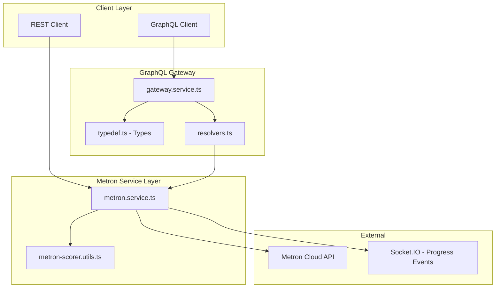
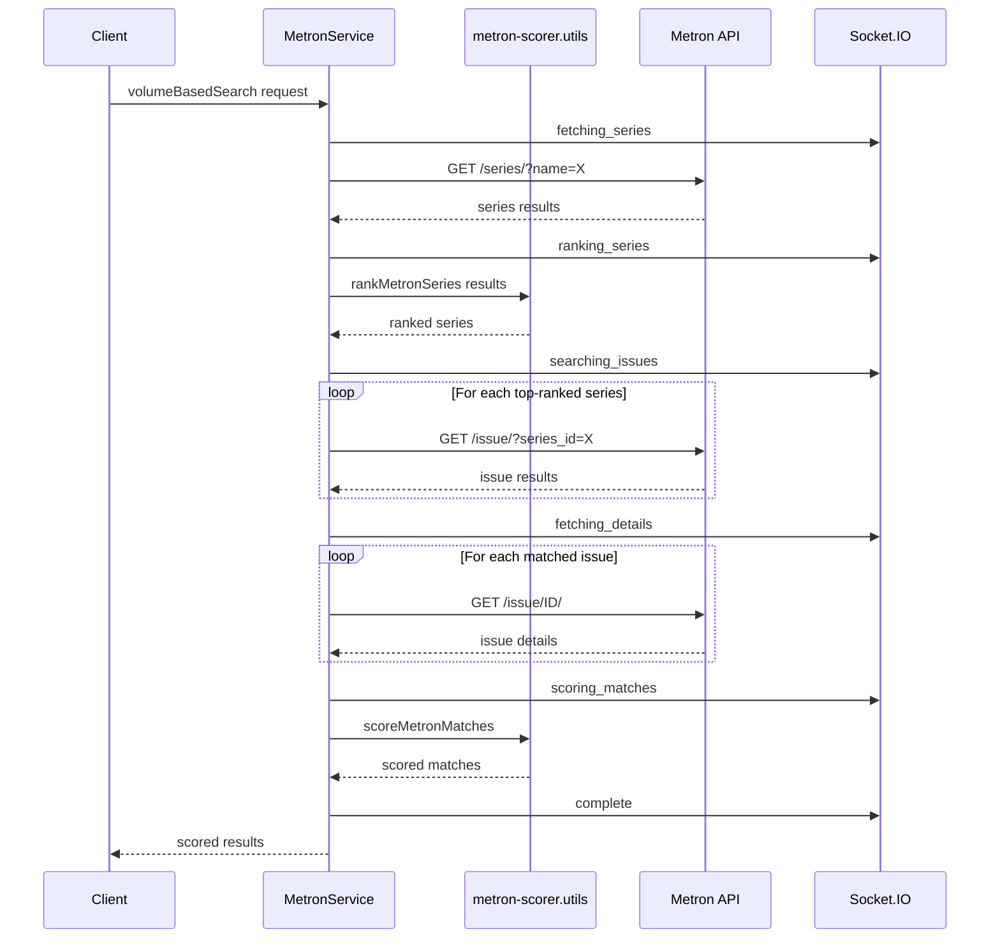

# Metron Service Modernization Plan

## Executive Summary

This plan outlines the modernization of the existing Metron service in [`services/metron.service.ts`](../services/metron.service.ts:1) from a basic 45-line implementation to a full-featured metadata service with GraphQL endpoints, mirroring the capabilities of the existing ComicVine service.

---

## Current State Analysis

### Existing Metron Service
- **Location:** [`services/metron.service.ts`](../services/metron.service.ts:1)
- **Lines of Code:** 45
- **Current Actions:** Only `fetchResource`
- **Issues Found:**
  - ❌ Hardcoded credentials (lines 34-36) - **CRITICAL SECURITY ISSUE**
  - ❌ No error handling
  - ❌ No rate limiting
  - ❌ No advanced search capabilities
  - ❌ No scoring/matching logic

### Reference Implementation: ComicVine Service
- **Location:** [`services/comicvine.service.ts`](../services/comicvine.service.ts:1)
- **Lines of Code:** 762
- **Features to Mirror:**
  - Environment-based configuration
  - [`volumeBasedSearch`](../services/comicvine.service.ts:188) with multi-stage workflow
  - Socket broadcasts for real-time progress
  - Scoring utilities integration
  - Comprehensive error handling

---

## Architecture Overview



---

## Phase 1: Metron Service Modernization

### 1.1 Configuration & Security Updates

**File:** [`services/metron.service.ts`](../services/metron.service.ts:1)

#### Environment Variables Required

```bash
# Add to .env or docker-compose.env
METRON_USERNAME=your_username
METRON_PASSWORD=your_password
METRON_API_BASE_URL=https://metron.cloud/api
METRON_RATE_LIMIT_MS=1000
```

#### Code Changes

```typescript
// Constants at top of file
const METRON_BASE_URL = process.env.METRON_API_BASE_URL || "https://metron.cloud/api";
const METRON_RATE_LIMIT_MS = parseInt(process.env.METRON_RATE_LIMIT_MS || "1000", 10);

// Authentication helper
private getAuthConfig() {
    const username = process.env.METRON_USERNAME;
    const password = process.env.METRON_PASSWORD;
    
    if (!username || !password) {
        throw new MoleculerError(
            "Metron credentials not configured",
            500,
            "METRON_AUTH_ERROR"
        );
    }
    
    return { username, password };
}

// Rate limiting with delay between requests
private lastRequestTime = 0;

private async rateLimitedRequest<T>(requestFn: () => Promise<T>): Promise<T> {
    const now = Date.now();
    const timeSinceLastRequest = now - this.lastRequestTime;
    
    if (timeSinceLastRequest < METRON_RATE_LIMIT_MS) {
        await delay(METRON_RATE_LIMIT_MS - timeSinceLastRequest);
    }
    
    this.lastRequestTime = Date.now();
    return requestFn();
}
```

---

### 1.2 Metron volumeBasedSearch Action

**Workflow Diagram:**



#### Action Definition

```typescript
volumeBasedSearch: {
    rest: "POST /volumeBasedSearch",
    params: {
        scorerConfiguration: { type: "object" },
        rawFileDetails: { type: "object", optional: true },
    },
    timeout: 10000000,
    handler: async (ctx: Context<MetronVolumeSearchParams>) => {
        const { scorerConfiguration, rawFileDetails } = ctx.params;
        
        // Stage 1: Search series
        await this.broadcastStatus("fetching_series", 
            `Searching Metron for: ${scorerConfiguration.searchParams.name}`);
        
        const series = await this.searchSeries(ctx, {
            name: scorerConfiguration.searchParams.name,
            page: 1
        });
        
        // Stage 2: Rank series
        await this.broadcastStatus("ranking_series", 
            `Found ${series.length} series, ranking matches...`);
        
        const rankedSeries = rankMetronSeries(series, scorerConfiguration);
        
        // Stage 3: Search issues
        await this.broadcastStatus("searching_issues",
            `Searching issues in ${rankedSeries.length} series...`);
        
        const issueMatches = await this.searchIssuesInSeries(
            rankedSeries,
            scorerConfiguration
        );
        
        // Stage 4: Fetch details
        await this.broadcastStatus("fetching_details",
            `Fetching details for ${issueMatches.length} issues...`);
        
        const detailedMatches = await this.fetchIssueDetails(issueMatches);
        
        // Stage 5: Score matches
        await this.broadcastStatus("scoring_matches",
            `Scoring ${detailedMatches.length} matches...`);
        
        const scoredMatches = await scoreMetronMatches(
            detailedMatches,
            scorerConfiguration.searchParams,
            rawFileDetails
        );
        
        // Stage 6: Complete
        await this.broadcastStatus("complete",
            `Search complete! Found ${scoredMatches.length} matches.`);
        
        return {
            finalMatches: scoredMatches,
            rawFileDetails,
            scorerConfiguration,
        };
    }
}
```

---

### 1.3 Supporting Actions

| Action | REST Endpoint | Purpose |
|--------|---------------|---------|
| `searchSeries` | `GET /searchSeries` | Search Metron series by name |
| `getSeriesById` | `GET /series/:id` | Get series details by ID |
| `searchIssues` | `GET /searchIssues` | Search issues with filters |
| `getIssueById` | `GET /issue/:id` | Get issue details by ID |
| `getMetronMatchScores` | `POST /getMetronMatchScores` | Score matches using Metron-adapted algorithm |

#### searchSeries

```typescript
searchSeries: {
    rest: "GET /searchSeries",
    params: {
        name: "string",
        page: { type: "number", optional: true, default: 1 },
    },
    handler: async (ctx: Context<{ name: string; page?: number }>) => {
        const { name, page } = ctx.params;
        
        return this.rateLimitedRequest(async () => {
            const response = await axios({
                method: "GET",
                url: `${METRON_BASE_URL}/series/`,
                params: { name, page },
                auth: this.getAuthConfig(),
            });
            return response.data;
        });
    }
}
```

#### getSeriesById

```typescript
getSeriesById: {
    rest: "GET /series/:id",
    params: {
        id: "number",
    },
    handler: async (ctx: Context<{ id: number }>) => {
        return this.rateLimitedRequest(async () => {
            const response = await axios({
                method: "GET",
                url: `${METRON_BASE_URL}/series/${ctx.params.id}/`,
                auth: this.getAuthConfig(),
            });
            return response.data;
        });
    }
}
```

---

### 1.4 Metron-Specific Scoring Utilities

**New File:** [`utils/metron-scorer.utils.ts`](../utils/metron-scorer.utils.ts)

#### Data Structure Mapping

| Metron Field | ComicVine Equivalent | Adaptation Required |
|--------------|---------------------|---------------------|
| `series.name` | `volume.name` | Direct mapping |
| `series.year_began` | `volume.start_year` | Direct mapping |
| `series.issue_count` | `volume.count_of_issues` | Direct mapping |
| `series.publisher.name` | `volume.publisher.name` | Nested access |
| `issue.number` | `issue.issue_number` | String parsing needed |
| `issue.cover_date` | `issue.cover_date` | Format normalization |
| `issue.image` | `issue.image.small_url` | URL extraction |

#### Implementation

```typescript
// utils/metron-scorer.utils.ts

import { isNil } from "lodash";
import leven from "leven";
import { parseISO, isAfter, isSameYear } from "date-fns";

const compareTwoStrings = (str1: string, str2: string): number => {
    if (str1 === str2) return 1;
    const maxLen = Math.max(str1.length, str2.length);
    if (maxLen === 0) return 1;
    return 1 - leven(str1, str2) / maxLen;
};

export interface MetronScorerConfig {
    searchParams: {
        name: string;
        number?: string;
        year?: string;
        subtitle?: string;
    };
}

export const rankMetronSeries = (
    series: MetronSeries[],
    scorerConfiguration: MetronScorerConfig
) => {
    const issueNumber = parseInt(scorerConfiguration.searchParams.number || "1", 10);
    const issueYear = scorerConfiguration.searchParams.year 
        ? parseISO(scorerConfiguration.searchParams.year) 
        : null;
    
    const rankedSeries = series.map((seriesItem) => {
        let seriesMatchScore = 0;
        const seriesStartYear = seriesItem.year_began 
            ? parseISO(seriesItem.year_began.toString()) 
            : null;
        
        // Name matching
        let nameMatchScore = compareTwoStrings(
            scorerConfiguration.searchParams.name.toLowerCase(),
            seriesItem.name.toLowerCase()
        );
        
        // Subtitle matching (if present)
        if (scorerConfiguration.searchParams.subtitle) {
            const subtitleScore = compareTwoStrings(
                scorerConfiguration.searchParams.subtitle.toLowerCase(),
                seriesItem.name.toLowerCase()
            );
            if (subtitleScore > 0.1) {
                nameMatchScore += subtitleScore;
            }
        }
        
        // Year matching
        if (seriesStartYear && issueYear) {
            if (isSameYear(issueYear, seriesStartYear) || 
                isAfter(issueYear, seriesStartYear)) {
                seriesMatchScore += 2;
            }
        }
        
        // Issue count check
        if (seriesItem.issue_count && seriesItem.issue_count >= issueNumber) {
            seriesMatchScore += 3;
        }
        
        if (nameMatchScore > 0.5 && seriesMatchScore > 2) {
            return {
                id: seriesItem.id,
                seriesMatchScore,
                nameMatchScore,
                totalScore: seriesMatchScore + nameMatchScore,
                seriesData: seriesItem,
            };
        }
        return null;
    });
    
    return rankedSeries
        .filter((item) => !isNil(item))
        .sort((a, b) => b!.totalScore - a!.totalScore);
};

export const scoreMetronMatches = async (
    matches: MetronIssue[],
    searchQuery: MetronScorerConfig["searchParams"],
    rawFileDetails: any
): Promise<ScoredMetronMatch[]> => {
    const scoredMatches: ScoredMetronMatch[] = [];
    
    for (const match of matches) {
        let score = 0;
        
        // Issue number matching
        if (searchQuery.number && match.number) {
            const queryNum = parseInt(searchQuery.number, 10);
            const matchNum = parseInt(match.number, 10);
            if (!isNaN(queryNum) && !isNaN(matchNum) && queryNum === matchNum) {
                score += 1;
            }
        }
        
        // Year matching from cover_date
        if (searchQuery.year && match.cover_date) {
            const queryYear = parseInt(searchQuery.year, 10);
            const matchYear = new Date(match.cover_date).getFullYear();
            if (queryYear === matchYear) {
                score += 0.5;
            }
        }
        
        // Image hash comparison (if rawFileDetails available)
        if (rawFileDetails?.cover?.filePath && match.image) {
            score = await calculateMetronImageScore(match, rawFileDetails, score);
        }
        
        scoredMatches.push({
            ...match,
            score,
        });
    }
    
    return scoredMatches.sort((a, b) => b.score - a.score);
};
```

---

### 1.5 Socket Events for Progress

**Event Name:** `METRON_SCRAPING_STATUS`

**Stages:**

| Stage | Description |
|-------|-------------|
| `fetching_series` | Searching Metron for series by name |
| `ranking_series` | Ranking series matches using scorer |
| `searching_issues` | Searching issues within matched series |
| `fetching_details` | Getting detailed issue information |
| `scoring_matches` | Calculating match scores |
| `complete` | Search finished successfully |
| `error` | An error occurred |

#### Implementation

```typescript
// Helper method in MetronService
private async broadcastStatus(stage: string, message: string, error?: any) {
    await this.broker.call("socket.broadcast", {
        namespace: "/",
        event: "METRON_SCRAPING_STATUS",
        args: [{
            message,
            stage,
            ...(error && { error }),
        }],
    });
}
```

---

## Phase 2: GraphQL Integration

### 2.1 GraphQL Types

**File:** [`models/graphql/typedef.ts`](../models/graphql/typedef.ts:1)

```graphql
# ============================================
# Metron Types - Add after line 232
# ============================================

# Metron Publisher
type MetronPublisher {
    id: Int!
    name: String!
}

# Metron Series
type MetronSeries {
    id: Int!
    name: String!
    sort_name: String
    volume: Int
    year_began: Int
    year_end: Int
    issue_count: Int
    publisher: MetronPublisher
    image: String
    resource_url: String
}

# Metron Issue
type MetronIssue {
    id: Int!
    number: String!
    cover_date: String
    store_date: String
    image: String
    cover_hash: String
    series: MetronSeriesRef
    resource_url: String
}

# Metron Series Reference (minimal)
type MetronSeriesRef {
    id: Int!
    name: String!
}

# Metron Issue Detail (extended)
type MetronIssueDetail {
    id: Int!
    number: String!
    cover_date: String
    store_date: String
    image: String
    cover_hash: String
    series: MetronSeries
    resource_url: String
    title: String
    desc: String
    credits: [MetronCredit!]
    characters: [MetronCharacter!]
    teams: [MetronTeam!]
    arcs: [MetronArc!]
}

# Metron Credit
type MetronCredit {
    id: Int!
    creator: String!
    role: [String!]!
}

# Metron Character
type MetronCharacter {
    id: Int!
    name: String!
}

# Metron Team
type MetronTeam {
    id: Int!
    name: String!
}

# Metron Arc (Story Arc)
type MetronArc {
    id: Int!
    name: String!
}

# Scored Metron Match
type ScoredMetronMatch {
    issue: MetronIssueDetail!
    series: MetronSeries!
    score: Float!
    nameMatchScore: Float
    seriesMatchScore: Float
}

# Metron Search Results
type MetronSeriesSearchResult {
    count: Int!
    next: String
    previous: String
    results: [MetronSeries!]!
}

type MetronIssueSearchResult {
    count: Int!
    next: String
    previous: String
    results: [MetronIssue!]!
}

# Metron Volume-Based Search Response
type MetronVolumeBasedSearchResponse {
    finalMatches: [ScoredMetronMatch!]!
    rawFileDetails: JSON
    scorerConfiguration: JSON
}
```

---

### 2.2 GraphQL Inputs

```graphql
# ============================================
# Metron Input Types - Add to typedef.ts
# ============================================

# Metron Series Search Input
input MetronSeriesSearchInput {
    name: String!
    page: Int
}

# Metron Issue Search Input
input MetronIssueSearchInput {
    series_id: Int
    number: String
    cover_year: Int
    page: Int
}

# Metron Volume-Based Search Input
input MetronVolumeSearchInput {
    scorerConfiguration: MetronScorerConfigInput!
    rawFileDetails: JSON
}

# Metron Scorer Configuration
input MetronScorerConfigInput {
    searchParams: MetronSearchParamsInput!
}

# Metron Search Parameters
input MetronSearchParamsInput {
    name: String!
    number: String
    year: String
    subtitle: String
}

# Apply Metron Metadata Input
input ApplyMetronMetadataInput {
    comicObjectId: String!
    match: MetronMatchInput!
}

# Metron Match Input (for applying metadata)
input MetronMatchInput {
    issueId: Int!
    seriesId: Int!
}
```

---

### 2.3 GraphQL Queries

```graphql
# Add to Query type in typedef.ts

type Query {
    # ... existing queries ...
    
    """
    Search Metron series by name
    """
    searchMetronSeries(input: MetronSeriesSearchInput!): MetronSeriesSearchResult!
    
    """
    Get Metron series by ID
    """
    getMetronSeriesById(id: Int!): MetronSeries
    
    """
    Search Metron issues with filters
    """
    searchMetronIssues(input: MetronIssueSearchInput!): MetronIssueSearchResult!
    
    """
    Get Metron issue by ID
    """
    getMetronIssueById(id: Int!): MetronIssueDetail
    
    """
    Advanced volume-based search for Metron with scoring
    """
    metronVolumeBasedSearch(input: MetronVolumeSearchInput!): MetronVolumeBasedSearchResponse!
}
```

---

### 2.4 GraphQL Resolvers

**File:** [`models/graphql/resolvers.ts`](../models/graphql/resolvers.ts:1)

```typescript
// Add to Query object in resolvers.ts

/**
 * Search Metron series by name
 */
searchMetronSeries: async (_: any, { input }: any, context: any) => {
    const { broker } = context;
    
    if (!broker) {
        throw new Error("Broker not available in context");
    }
    
    return broker.call("metron.searchSeries", {
        name: input.name,
        page: input.page || 1,
    });
},

/**
 * Get Metron series by ID
 */
getMetronSeriesById: async (_: any, { id }: any, context: any) => {
    const { broker } = context;
    
    if (!broker) {
        throw new Error("Broker not available in context");
    }
    
    return broker.call("metron.getSeriesById", { id });
},

/**
 * Search Metron issues
 */
searchMetronIssues: async (_: any, { input }: any, context: any) => {
    const { broker } = context;
    
    if (!broker) {
        throw new Error("Broker not available in context");
    }
    
    return broker.call("metron.searchIssues", {
        series_id: input.series_id,
        number: input.number,
        cover_year: input.cover_year,
        page: input.page || 1,
    });
},

/**
 * Get Metron issue by ID
 */
getMetronIssueById: async (_: any, { id }: any, context: any) => {
    const { broker } = context;
    
    if (!broker) {
        throw new Error("Broker not available in context");
    }
    
    return broker.call("metron.getIssueById", { id });
},

/**
 * Advanced volume-based search for Metron
 */
metronVolumeBasedSearch: async (_: any, { input }: any, context: any) => {
    const { broker } = context;
    
    if (!broker) {
        throw new Error("Broker not available in context");
    }
    
    return broker.call("metron.volumeBasedSearch", {
        scorerConfiguration: input.scorerConfiguration,
        rawFileDetails: input.rawFileDetails,
    });
},
```

---

### 2.5 GraphQL Mutations

```graphql
# Add to Mutation type in typedef.ts

type Mutation {
    # ... existing mutations ...
    
    """
    Apply Metron metadata to a comic book in the library
    """
    applyMetronMetadata(input: ApplyMetronMetadataInput!): ApplyMetadataResponse!
}

type ApplyMetadataResponse {
    success: Boolean!
    message: String
    updatedComicId: String
}
```

```typescript
// Add to Mutation object in resolvers.ts

/**
 * Apply Metron metadata to a comic book
 */
applyMetronMetadata: async (_: any, { input }: any, context: any) => {
    const { broker } = context;
    
    if (!broker) {
        throw new Error("Broker not available in context");
    }
    
    try {
        // 1. Get full issue details
        const issueDetails = await broker.call("metron.getIssueById", {
            id: input.match.issueId,
        });
        
        // 2. Get series details
        const seriesDetails = await broker.call("metron.getSeriesById", {
            id: input.match.seriesId,
        });
        
        // 3. Call library service to apply metadata
        await broker.call("library.applyMetronMetadata", {
            comicObjectId: input.comicObjectId,
            sourcedMetadata: {
                metron: {
                    issue: issueDetails,
                    seriesInformation: seriesDetails,
                    lastUpdated: new Date(),
                },
            },
        });
        
        return {
            success: true,
            message: "Metron metadata applied successfully",
            updatedComicId: input.comicObjectId,
        };
    } catch (error: any) {
        return {
            success: false,
            message: error.message,
            updatedComicId: null,
        };
    }
},
```

---

## File Structure Summary

```
threetwo-metadata-service/
├── services/
│   ├── metron.service.ts          # MODIFY - Major expansion
│   ├── comicvine.service.ts       # Reference - No changes
│   ├── gateway.service.ts         # No changes needed
│   └── api.service.ts             # May need REST endpoint additions
├── utils/
│   ├── searchmatchscorer.utils.ts # Reference - No changes
│   └── metron-scorer.utils.ts     # NEW FILE
├── models/
│   └── graphql/
│       ├── typedef.ts             # MODIFY - Add Metron types
│       └── resolvers.ts           # MODIFY - Add Metron resolvers
├── types/
│   └── metron.types.ts            # NEW FILE - TypeScript interfaces
└── docker-compose.env             # MODIFY - Add Metron env vars
```

---

## TypeScript Interfaces

**New File:** `types/metron.types.ts`

```typescript
export interface MetronSeries {
    id: number;
    name: string;
    sort_name: string;
    volume: number;
    year_began: number;
    year_end: number | null;
    issue_count: number;
    publisher: MetronPublisher;
    image: string;
    resource_url: string;
}

export interface MetronPublisher {
    id: number;
    name: string;
}

export interface MetronIssue {
    id: number;
    number: string;
    cover_date: string;
    store_date: string | null;
    image: string;
    cover_hash: string;
    series: {
        id: number;
        name: string;
    };
    resource_url: string;
}

export interface MetronIssueDetail extends MetronIssue {
    title: string | null;
    desc: string | null;
    credits: MetronCredit[];
    characters: MetronCharacter[];
    teams: MetronTeam[];
    arcs: MetronArc[];
}

export interface MetronCredit {
    id: number;
    creator: string;
    role: string[];
}

export interface MetronCharacter {
    id: number;
    name: string;
}

export interface MetronTeam {
    id: number;
    name: string;
}

export interface MetronArc {
    id: number;
    name: string;
}

export interface ScoredMetronMatch {
    issue: MetronIssueDetail;
    series: MetronSeries;
    score: number;
    nameMatchScore?: number;
    seriesMatchScore?: number;
}

export interface MetronVolumeSearchParams {
    scorerConfiguration: {
        searchParams: {
            name: string;
            number?: string;
            year?: string;
            subtitle?: string;
        };
    };
    rawFileDetails?: any;
}
```

---

## Environment Variables

```bash
# Add to docker-compose.env
METRON_USERNAME=your_metron_username
METRON_PASSWORD=your_metron_password
METRON_API_BASE_URL=https://metron.cloud/api
METRON_RATE_LIMIT_MS=1000
```

---

## Testing Strategy

### Unit Tests

**File:** `test/unit/services/metron.spec.ts`

1. Test configuration loading (env vars)
2. Test rate limiting functionality
3. Test error handling for auth failures
4. Test series search parsing
5. Test issue search parsing
6. Test scoring algorithm accuracy

### Integration Tests

**File:** `test/integration/metron.spec.ts`

1. Test full volumeBasedSearch workflow
2. Test GraphQL query execution
3. Test mutation for applying metadata
4. Test socket event emissions

---

## Risks and Mitigations

| Risk | Impact | Mitigation |
|------|--------|------------|
| Metron API rate limiting | Requests blocked | Read rate limit headers and wait until reset timestamp |
| Different data structure than CV | Incorrect scoring | Create dedicated adapter layer in scoring utils |
| Credentials exposure | Security breach | Use environment variables, never commit credentials |
| API unavailability | Service failure | Add timeout handling, circuit breaker, user-friendly errors |
| Image URL differences | Hash comparison fails | Normalize image URLs in adapter before hashing |

---

## Appendix: Rate Limiting Implementation - Official API

Based on official Metron API documentation: https://metron.cloud/wiki/api/api-documentation/

### Rate Limit Response Headers

Metron returns rate limit information in response headers:

| Header | Description |
|--------|-------------|
| `X-RateLimit-Burst-Limit` | Maximum requests allowed in burst window |
| `X-RateLimit-Burst-Remaining` | Requests remaining in burst window |
| `X-RateLimit-Burst-Reset` | Unix timestamp when burst limit resets |
| `X-RateLimit-Sustained-Limit` | Maximum requests allowed in sustained window |
| `X-RateLimit-Sustained-Remaining` | Requests remaining in sustained window |
| `X-RateLimit-Sustained-Reset` | Unix timestamp when sustained limit resets |

### Conditional Requests for Caching

Metron supports HTTP conditional requests to reduce bandwidth:

1. **First Request:** Get resource, note `Last-Modified` header
2. **Subsequent Requests:** Include `If-Modified-Since` header
3. **If Unchanged:** API returns `304 Not Modified` with no body
4. **If Changed:** API returns `200 OK` with full response

### Rate Limiting Implementation

```typescript
interface RateLimitState {
    burstLimit: number;
    burstRemaining: number;
    burstReset: number;
    sustainedLimit: number;
    sustainedRemaining: number;
    sustainedReset: number;
}

interface CachedResource {
    data: any;
    lastModified: string;
    cachedAt: number;
}

// Update rate limit state from response headers
private updateRateLimitState(headers: any): void {
    if (headers["x-ratelimit-burst-remaining"]) {
        this.rateLimitState.burstRemaining = parseInt(headers["x-ratelimit-burst-remaining"], 10);
    }
    if (headers["x-ratelimit-burst-reset"]) {
        this.rateLimitState.burstReset = parseInt(headers["x-ratelimit-burst-reset"], 10);
    }
    if (headers["x-ratelimit-sustained-remaining"]) {
        this.rateLimitState.sustainedRemaining = parseInt(headers["x-ratelimit-sustained-remaining"], 10);
    }
    if (headers["x-ratelimit-sustained-reset"]) {
        this.rateLimitState.sustainedReset = parseInt(headers["x-ratelimit-sustained-reset"], 10);
    }
}

// Wait until rate limit resets if necessary
private async respectRateLimit(): Promise<void> {
    const now = Math.floor(Date.now() / 1000);
    
    if (this.rateLimitState.burstRemaining <= 0) {
        const waitTime = (this.rateLimitState.burstReset - now) * 1000;
        if (waitTime > 0) {
            await delay(waitTime);
        }
    }
    
    if (this.rateLimitState.sustainedRemaining <= 0) {
        const waitTime = (this.rateLimitState.sustainedReset - now) * 1000;
        if (waitTime > 0) {
            await delay(waitTime);
        }
    }
}

// Make request with conditional GET for caching
private async conditionalRequest<T>(url: string, params?: any): Promise<T> {
    await this.respectRateLimit();
    
    const cacheKey = `${url}?${JSON.stringify(params || {})}`;
    const cached = this.resourceCache.get(cacheKey);
    
    const headers: any = { "Accept": "application/json", "User-Agent": "ThreeTwo" };
    if (cached?.lastModified) {
        headers["If-Modified-Since"] = cached.lastModified;
    }
    
    const response = await axios({
        method: "GET",
        url,
        params,
        auth: this.getAuthConfig(),
        headers,
        validateStatus: (status) => status === 200 || status === 304,
    });
    
    this.updateRateLimitState(response.headers);
    
    if (response.status === 304 && cached) {
        return cached.data;
    }
    
    if (response.headers["last-modified"]) {
        this.resourceCache.set(cacheKey, {
            data: response.data,
            lastModified: response.headers["last-modified"],
            cachedAt: Date.now(),
        });
    }
    
    return response.data;
}
```

### Error Response Format

All Metron errors return JSON with a `detail` field:

```json
{ "detail": "Error message describing what went wrong" }
```

### HTTP Status Codes

| Code | Meaning |
|------|---------|
| `200 OK` | Success |
| `201 Created` | Resource created |
| `304 Not Modified` | Use cached data |
| `400 Bad Request` | Invalid request data |
| `401 Unauthorized` | Authentication required |
| `403 Forbidden` | Insufficient permissions |
| `404 Not Found` | Resource not found |
| `429 Too Many Requests` | Rate limit exceeded |
| `500 Internal Server Error` | Server error |

---

## Dependencies

No new dependencies required. Existing packages are sufficient:

- `axios` - HTTP requests to Metron API
- `lodash` - Utility functions
- `leven` - Levenshtein distance for string comparison
- `date-fns` - Date parsing and comparison
- `delay` - Rate limiting delays

---

## Implementation Order

1. **Phase 1.1** - Configuration & security (foundation)
2. **Phase 1.3** - Supporting actions (building blocks)
3. **Phase 1.4** - Scoring utilities (required for search)
4. **Phase 1.2** - volumeBasedSearch (main feature)
5. **Phase 1.5** - Socket events (UX enhancement)
6. **Phase 2.1-2.2** - GraphQL types and inputs
7. **Phase 2.3-2.4** - GraphQL queries and resolvers
8. **Phase 2.5** - Mutations
9. **Testing & Documentation**

---

## GraphQL Query Examples

### Search Series

```graphql
query SearchMetronSeries {
    searchMetronSeries(input: { name: "Batman", page: 1 }) {
        count
        results {
            id
            name
            year_began
            publisher {
                name
            }
            issue_count
        }
    }
}
```

### Volume-Based Search

```graphql
query MetronVolumeSearch {
    metronVolumeBasedSearch(input: {
        scorerConfiguration: {
            searchParams: {
                name: "Batman"
                number: "1"
                year: "2016"
            }
        }
    }) {
        finalMatches {
            score
            issue {
                id
                number
                cover_date
                image
            }
            series {
                name
                publisher {
                    name
                }
            }
        }
    }
}
```

### Apply Metadata Mutation

```graphql
mutation ApplyMetron {
    applyMetronMetadata(input: {
        comicObjectId: "65f4a1b2c3d4e5f6g7h8i9j0"
        match: {
            issueId: 12345
            seriesId: 678
        }
    }) {
        success
        message
        updatedComicId
    }
}
```
